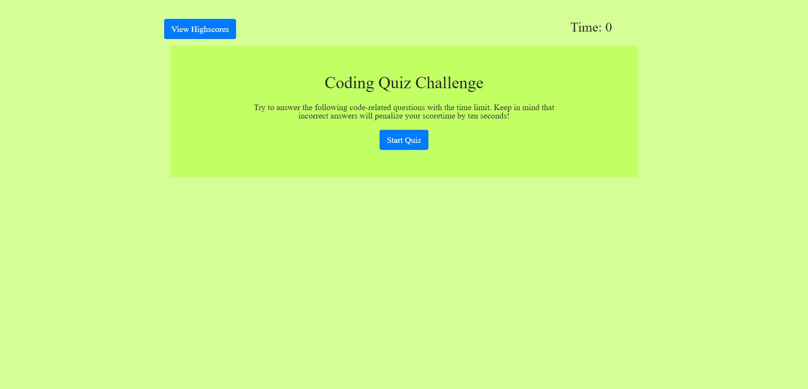
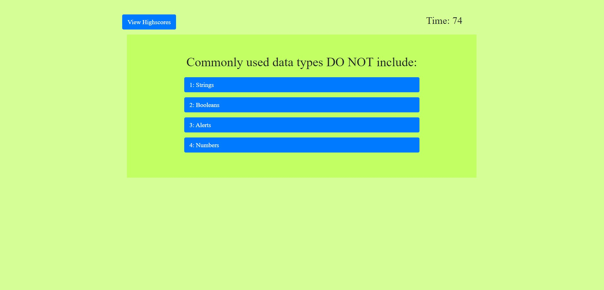
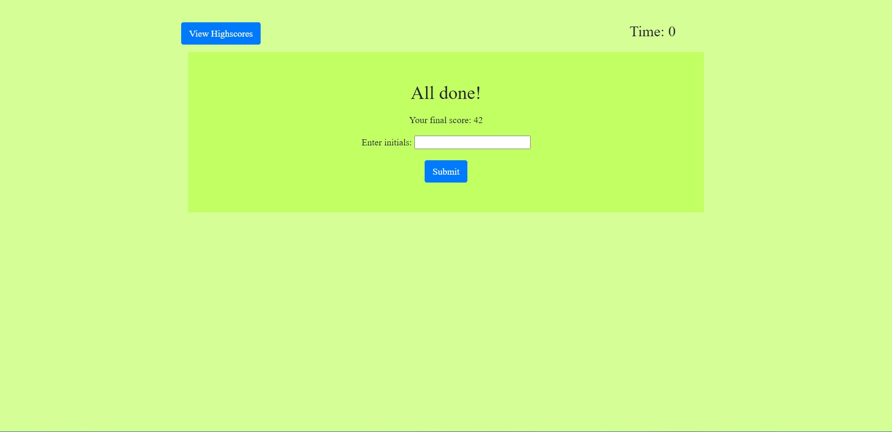

# basic-coding-quiz

# Basic Coding Quiz Practice

### Purpose:

* To create a basic coding quiz that will have a timer and save scores

### Written with:
* HTML
* CSS
* JS

## Website:
https://nchan22.github.io/basic-coding-quiz/

## Future Uses:
* Update to be more advanced questions
* Update to allow user to suggest questions
* Update to provide different types of questions (e.g. true/false, short answer, long answer, etc.)

## Screenshots

## Contributors:

Written by Nathaniel Chan

reset.css created with the help of: 
http://meyerweb.com/eric/tools/css/reset/ 
   v2.0 | 20110126
   License: none (public domain)
   
